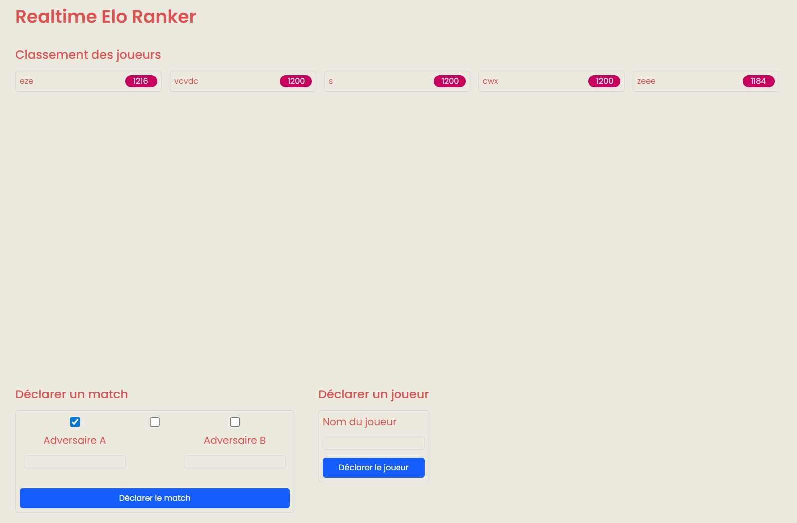

# Rendu TP - Realtime Elo Ranker

**Auteur** : Elyandre Buret  
**Date** : 05/02/2026  
**Projet** : Application web de calcul de classement ELO en temps réel

---

## Sommaire

1. [Présentation](#vue-densemble)
2. [Architecture technique](#architecture-technique)
3. [Fonctionnalités implémentées](#fonctionnalités-implémentées)
6. [Guide d'utilisation](#guide-dutilisation)
7. [Tests](#tests)
8. [Conformité aux consignes](#conformité-aux-consignes)

---

## Présentation

Realtime Elo Ranker est une application web complète permettant de gérer des matchs entre joueurs et de calculer automatiquement leur classement ELO en temps réel. Le système met à jour le classement après chaque match et notifie instantanément tous les clients connectés via Server-Sent Events (SSE).


## Architecture technique


### Flux de données

1. **Création de joueur** : Controller → PlayerService → DB → Retour avec rank initial (moyenne)
2. **Soumission de match** : Controller → MatchService → EloCalculator → PlayerService → RankingService (emit event)
3. **Récupération du classement** : Controller → RankingService → Cache/PlayerService
4. **Stream temps réel** : Client SSE ← RankingService (Observable RxJS)

---

## Fonctionnalités implémentées

### 1. Gestion des joueurs

**Endpoint** : `POST /api/player`

- Création d'un nouveau joueur avec ID unique
- Attribution automatique du classement initial :
  - Si aucun joueur : **1200** (valeur par défaut)
  - Sinon : **moyenne des classements existants** (arrondi)
- Validation : ID obligatoire et non vide

**Exemple de requête** :
```json
POST /api/player
{
  "id": "player1"
}
```

**Réponse** :
```json
{
  "id": "player1",
  "rank": 1200
}
```

### 2. Soumission de matchs

**Endpoint** : `POST /api/match`

- Enregistrement d'un résultat de match (victoire/défaite/égalité)
- Calcul automatique des nouveaux classements ELO
- Mise à jour de la base de données
- Émission d'un événement temps réel
- Archivage du match dans l'historique

**Exemple de requête** :
```json
POST /api/match
{
  "winnerId": "player1",
  "loserId": "player2",
  "isDraw": false
}
```

**Réponse** :
```json
{
  "winner": {
    "id": "player1",
    "rank": 1216
  },
  "loser": {
    "id": "player2",
    "rank": 1184
  }
}
```

### 3. Récupération du classement

**Endpoint** : `GET /api/ranking`

- Retourne la liste complète des joueurs triés par classement (décroissant)
- Cache en mémoire pour optimisation

**Réponse** :
```json
[
  { "id": "player1", "rank": 1216 },
  { "id": "player2", "rank": 1184 }
]
```

### 4. Mises à jour en temps réel

**Endpoint** : `GET /api/ranking/events`

- Stream Server-Sent Events (SSE)
- Notifications instantanées des changements de classement
- Connexion persistante jusqu'à déconnexion du client

---

## Guide d'utilisation

### Prérequis

- Node.js 22.14.0+
- pnpm 10.28.2+

### Installation

```bash
# Cloner le projet
cd TP-Dev-Avance

# Installer les dépendances
pnpm install
```

### Lancement du serveur

```bash
# Démarrer le serveur en mode développement
cd apps/realtime-elo-ranker-server
pnpm start:dev

# Le serveur démarre sur http://localhost:3001
```

### Lancement du client

```bash
# Construire la librairie UI (prérequis)
pnpm run libs:ui:build

# Démarrer le client Next.js
pnpm run apps:client:dev

# Le client démarre sur http://localhost:3000
```
#### Vue du client 


### Utilisation de l'API

**Créer des joueurs** :
```bash
curl -X POST http://localhost:3001/api/player \
  -H "Content-Type: application/json" \
  -d '{"id": "alice"}'

curl -X POST http://localhost:3001/api/player \
  -H "Content-Type: application/json" \
  -d '{"id": "bob"}'
```

**Enregistrer un match** :
```bash
curl -X POST http://localhost:3001/api/match \
  -H "Content-Type: application/json" \
  -d '{"winnerId": "alice", "loserId": "bob", "isDraw": false}'
```

**Récupérer le classement** :
```bash
curl http://localhost:3001/api/ranking
```

**Se connecter au stream SSE** :
```bash
curl http://localhost:3001/api/ranking/events
```

---

## Tests

### Tests unitaires

**85 tests unitaires** avec une couverture de **84.84%** :

```bash
# Lancer tous les tests unitaires
cd apps/realtime-elo-ranker-server
pnpm test

# Tests avec couverture
pnpm test:cov
```

**Couverture détaillée** :

| Catégorie | Couverture | Description |
|-----------|------------|-------------|
| **Statements** | 84.84% | 140/165 instructions couvertes |
| **Branches** | 78.31% | 65/83 branches testées |
| **Functions** | 96.87% | 31/32 fonctions testées |
| **Lines** | 83.91% | 120/143 lignes couvertes |

**Répartition des tests** :

| Module | Tests | Description |
|---------|-------|-------------|
| **Services** | 43 | Logique métier complète |
| **Contrôleurs** | 24 | Endpoints HTTP (App, Player, Match, Ranking) |
| **DTOs** | 17 | Validation des entrées |
| **E2E** | 1 suite | 15 tests d'intégration complète |

### Tests d'intégration (E2E)

**15 tests E2E** validant les flux complets :

```bash
# Lancer les tests e2e
pnpm test:e2e
```

**Scénarios testés** :
- Création de joueurs
- Soumission de matchs
- Calculs ELO corrects
- Gestion des erreurs (joueurs inexistants, etc.)
- Événements temps réel

---

## Conformité aux consignes


- ✅ Architecture propre avec séparation des responsabilités
- ✅ Base de données TypeORM + SQLite  
- ✅ Tests complets (unitaires + e2e)
- ✅ API conforme au Swagger
- ✅ Temps réel avec SSE
- ✅ Validation des données
- ✅ Gestion d'erreurs appropriée

### Architecture 

```
apps/realtime-elo-ranker-server/
├── src/
│   ├── controllers/              # Couche HTTP
│   │   ├── app.controller.ts     # Route racine (/)
│   │   ├── player.controller.ts  # POST /api/player
│   │   ├── match.controller.ts   # POST /api/match
│   │   └── ranking.controller.ts # GET /api/ranking + SSE
│   │
│   ├── services/                 # Logique métier
│   │   ├── player.service.ts     # CRUD joueurs + DB
│   │   ├── match.service.ts      # Orchestration des matchs
│   │   ├── ranking.service.ts    # Cache + événements SSE
│   │   └── elo-calculator.service.ts # Calculs ELO purs
│   │
│   ├── entities/                 # Modèles de base de données
│   │   └── player.entity.ts      # Entité TypeORM Player
│   │
│   ├── dto/                      # Data Transfer Objects
│   │   ├── create-player.dto.ts  # Validation création joueur
│   │   └── create-match.dto.ts   # Validation soumission match
│   │
│   ├── models/                   # Interfaces métier
│   │   └── match-result.model.ts # Modèle résultat de match
│   │
│   ├── app.module.ts             # Configuration NestJS + TypeORM
│   └── main.ts                   # Point d'entrée (port 3001)
│
├── test/
│   ├── app.e2e-spec.ts           # 15 tests d'intégration
│   ├── controllers/              # Tests unitaires contrôleurs
│   │   ├── app.controller.spec.ts         # 6 tests
│   │   ├── player.controller.spec.ts      # 4 tests
│   │   ├── match.controller.spec.ts       # 6 tests
│   │   └── ranking.controller.spec.ts     # 8 tests
│   ├── dto/                      # Tests unitaires DTOs
│   │   ├── create-player.dto.spec.ts      # 6 tests
│   │   └── create-match.dto.spec.ts       # 11 tests
│   └── services/                 # Tests unitaires services
│       ├── elo-calculator.service.spec.ts # 11 tests
│       ├── player.service.spec.ts         # 12 tests
│       ├── ranking.service.spec.ts        # 8 tests
│       └── match.service.spec.ts          # 12 tests
│
└── package.json                  # Dépendances
```

### Endpoints API

| Endpoint | Méthode | Statut | Description |
|----------|---------|--------|-------------|
| `/api/player` | POST | ✅ | Création de joueur |
| `/api/match` | POST | ✅ | Soumission de match |
| `/api/ranking` | GET | ✅ | Récupération du classement |
| `/api/ranking/events` | GET | ✅ | Stream SSE |

---

## Conclusion
L'ensemble des consignes ont été respecté, cependant le bonus avec l'implémentation Simulateur de matchs n'a pas été réaliser
